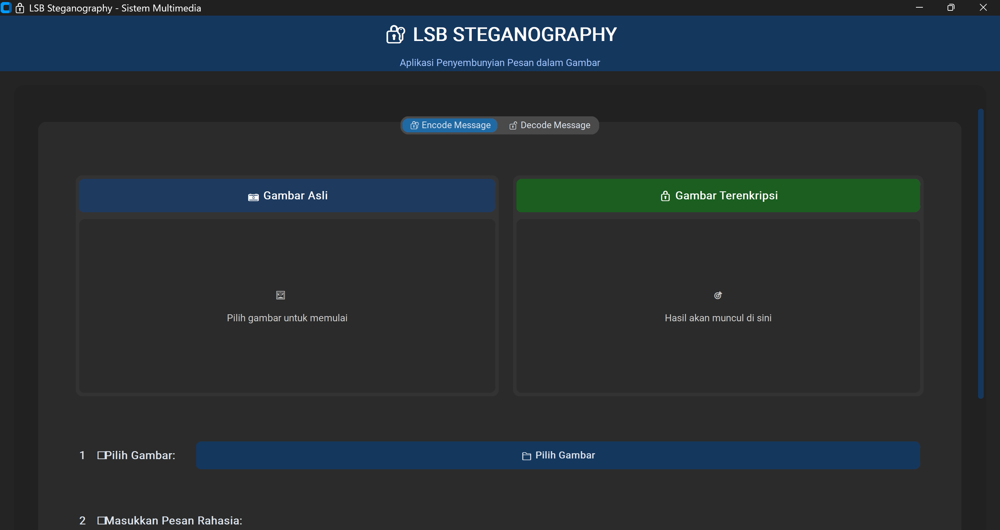
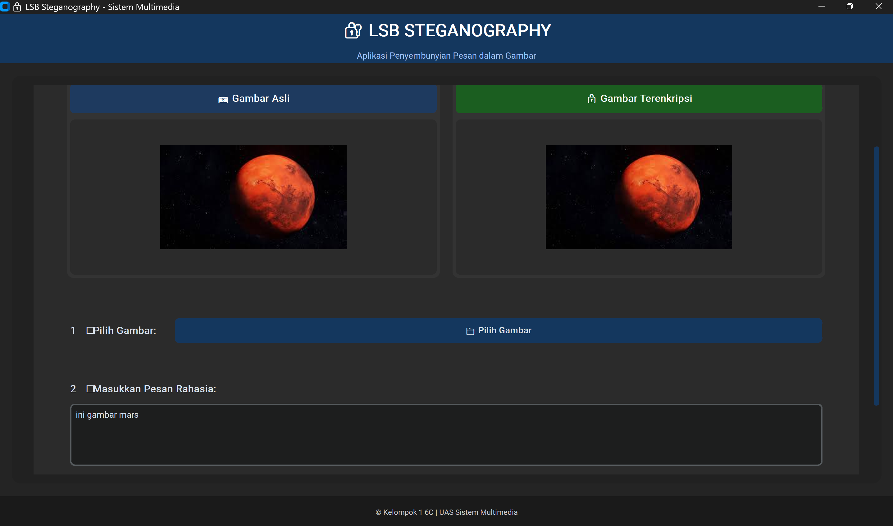
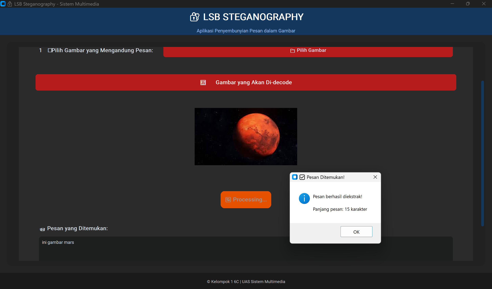

# 🔐 LSB Steganography - Sistem Multimedia

<div align="center">


**Aplikasi Desktop untuk Menyembunyikan dan Mengekstrak Pesan Rahasia dalam Gambar**

[Features](#-features) • [Installation](#-installation) • [Usage](#-usage) • [Screenshots](#-screenshots) • [Contributing](#-contributing)

</div>

---

## 📖 Deskripsi

**LSB Steganography** adalah aplikasi desktop yang menggunakan teknik **Least Significant Bit (LSB)** untuk menyembunyikan pesan rahasia di dalam gambar digital. Aplikasi ini dikembangkan menggunakan Python dengan antarmuka yang modern dan user-friendly.

### 🎯 Tujuan Proyek
- Implementasi algoritma steganografi LSB
- Menyediakan antarmuka yang mudah digunakan
- Mendukung berbagai format gambar
- Menjaga kualitas gambar setelah encoding

---

## ✨ Features

### 🔐 **Encode (Penyembunyian Pesan)**
- ✅ Pilih gambar dari komputer
- ✅ Masukkan pesan rahasia
- ✅ Preview gambar asli dan hasil
- ✅ Simpan gambar dengan pesan tersembunyi
- ✅ Validasi ukuran pesan otomatis

### 🔓 **Decode (Ekstraksi Pesan)**
- ✅ Buka gambar yang mengandung pesan
- ✅ Preview gambar sebelum decode
- ✅ Ekstraksi pesan tersembunyi
- ✅ Tampilkan hasil dalam text area

### 🎨 **User Interface**
- ✅ Antarmuka modern dengan CustomTkinter
- ✅ Dark/Light theme support
- ✅ Responsive design
- ✅ Tab-based navigation
- ✅ Progress indicators
- ✅ Error handling yang informatif

---

## 🛠️ Installation

### Prerequisites
Pastikan Anda memiliki Python 3.8+ terinstall di sistem Anda.

### 1. Clone Repository
```bash
git clone https://github.com/username/lsb-steganography.git
cd lsb-steganography
```

### 2. Install Dependencies
```bash
pip install -r requirements.txt
```

**Atau install manual:**
```bash
pip install customtkinter pillow
```

### 3. Run Application
```bash
python lsb_steganography.py
```

---

## 📋 Requirements

```txt
customtkinter>=5.2.0
pillow>=9.0.0
```

---

## 🚀 Usage

### 📝 **Encoding (Menyembunyikan Pesan)**

1. **Pilih Tab "🔐 Encode Message"**
2. **Klik "📁 Pilih Gambar"** untuk memilih gambar
3. **Masukkan pesan rahasia** di text area
4. **Klik "🚀 Proses Encode & Simpan"**
5. **Pilih lokasi penyimpanan** untuk gambar hasil

### 🔍 **Decoding (Mengekstrak Pesan)**

1. **Pilih Tab "🔓 Decode Message"**
2. **Klik "📁 Pilih Gambar"** yang mengandung pesan
3. **Klik "🔍 Proses Decode"**
4. **Pesan rahasia akan ditampilkan** di text area

---

## 📸 Screenshots

### Main Interface


### Encode Process


### Decode Process


---

## 🔬 Algoritma LSB

### Cara Kerja
1. **Encoding**: Mengubah setiap karakter pesan menjadi biner (8-bit)
2. **Insertion**: Mengganti bit terakhir (LSB) dari setiap channel RGB
3. **Delimiter**: Menambahkan "#####" sebagai penanda akhir pesan
4. **Decoding**: Mengekstrak LSB dan mengubah kembali menjadi karakter

### Contoh Proses
```
Pesan: "Hi"
Biner: 01001000 01101001

Pixel RGB: (255, 254, 253)
Biner:     11111111 11111110 11111101

Setelah LSB:
           11111110 11111111 11111100
RGB Baru:  (254, 255, 252)
```

---

## 🏗️ Struktur Proyek

```
lsb-steganography/
├── lsb_steganography.py    # File utama aplikasi
├── requirements.txt        # Dependencies
├── README.md              # Dokumentasi
├── screenshots/           # Screenshot aplikasi
│   ├── main-interface.png
│   ├── encode-process.png
│   └── decode-process.png
├── examples/              # Contoh gambar
│   ├── original.png
│   └── encoded.png
└── docs/                  # Dokumentasi tambahan
    └── deployment-guide.md
```

---

## 📦 Build Executable

Untuk membuat file executable (.exe):

### Quick Build
```bash
pip install pyinstaller
pyinstaller --onefile --windowed lsb_steganography.py
```

### Advanced Build
```bash
pyinstaller --onefile --windowed --name "LSB_Steganography" --add-data "customtkinter;customtkinter" --hidden-import customtkinter lsb_steganography.py
```

File executable akan tersedia di folder `dist/`

---

## 🧪 Testing

### Format Gambar yang Didukung
- ✅ PNG (Recommended)
- ✅ JPG/JPEG
- ✅ BMP
- ✅ GIF

### Batasan
- **Ukuran pesan** terbatas pada kapasitas gambar (width × height × 3)
- **Format output** selalu PNG untuk menjaga kualitas
- **Perubahan visual** minimal dan tidak terdeteksi mata

---

## 🤝 Contributing

Kontribusi sangat diterima! Berikut cara berkontribusi:

1. **Fork** repository ini
2. **Buat branch** untuk fitur baru (`git checkout -b feature/AmazingFeature`)
3. **Commit** perubahan (`git commit -m 'Add some AmazingFeature'`)
4. **Push** ke branch (`git push origin feature/AmazingFeature`)
5. **Buka Pull Request**

### 📝 Guidelines
- Pastikan kode mengikuti PEP 8
- Tambahkan docstring untuk fungsi baru
- Test fitur sebelum submit PR
- Update dokumentasi jika diperlukan

---

## 🐛 Known Issues

- [ ] File JPEG kadang mengalami degradasi kualitas
- [ ] Pesan sangat panjang dapat menyebabkan crash
- [ ] Dark theme belum optimal di beberapa widget

---

## 🔮 Future Features

- [ ] **Enkripsi pesan** sebelum steganografi
- [ ] **Batch processing** multiple files
- [ ] **Drag & drop** interface
- [ ] **Password protection** untuk pesan
- [ ] **Compression** untuk pesan panjang
- [ ] **Audio steganography** support

---

## 📚 Educational Purpose

Proyek ini dikembangkan untuk tujuan edukasi dalam mata kuliah **Sistem Multimedia**. Konsep yang dipelajari:

- **Steganografi Digital**
- **Manipulasi Bit Level**
- **Image Processing**  
- **GUI Development**
- **File Handling**

